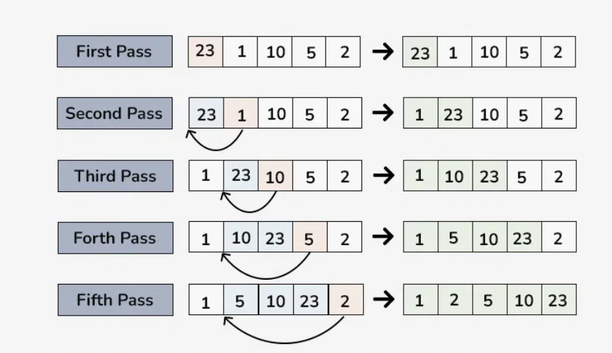

# Insertion Sort

Insertion Sort is a simple sorting algorithm that builds the final sorted array one item at a time by repeatedly taking the next element and inserting it into the sorted part of the array. It is efficient for small datasets and is often used as part of more complex sorting algorithms like Shell Sort and Timsort.

## Algorithm

1. **Start**: The first element of the array is considered sorted.
2. **Insertion**: For each subsequent element, compare it with the elements before it and insert it into the correct position in the sorted subarray.
3. **Repeat**: Repeat the process until all elements are sorted.

## Example



Let's walk through an example:

**Input**: [23, 1, 10, 5, 2]

1. **Step 1 (Initial State)**: The first element, 23, is considered sorted.
   Sorted Subarray: [23]
   Unsorted Subarray: [1, 10, 5, 2]

2. **Step 2 (Insert 1)**: Insert 1 into the sorted subarray.
   Sorted Subarray: [1, 23]
   Unsorted Subarray: [10, 5, 2]

3. **Step 3 (Insert 10)**: Insert 10 into the sorted subarray.
   Sorted Subarray: [1, 10, 23]
   Unsorted Subarray: [5, 2]

4. **Step 4 (Insert 5)**: Insert 5 into the sorted subarray.
   Sorted Subarray: [1, 5, 10, 23]
   Unsorted Subarray: [2]

5. **Step 5 (Insert 2)**: Insert 2 into the sorted subarray.
   Sorted Subarray: [1, 2, 5, 10, 23]
   Unsorted Subarray: []

**Output**: [1, 2, 5, 10, 23]

```c
#include <stdio.h>


void insertionSort(int array[], int size) {
    for (int i = 1; i < size; i++) {
        int key = array[i];
        int j = i - 1;
        while (j >= 0 && array[j] > key) {
            array[j + 1] = array[j];
            j--;
        }
        array[j + 1] = key;
    }
}

void printArr(int arr[], int size){
    for(int i =0; i<size; i++){
        printf("%d ",arr[i]);
    }
    printf("\n");
}

int main() {
    int array[] = {23, 1, 10, 5, 2};
    int size = sizeof(array) / sizeof(array[0]);

    printf("Original array: ");
    printArr(array, size);

    insertionSort(array, size); //Function call

    printf("\nSorted array: ");
    printArr(array, size);

    return 0;
}
```

**Time Complexity**: The worst-case time complexity of Insertion Sort is O(n^2)

**Space Complexity**: Insertion Sort has a space complexity of O(1) because it only requires a constant amount of extra space for variables.
