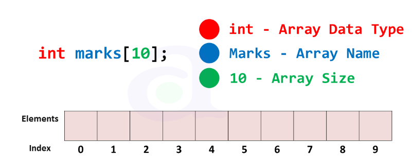

# Arrays in C

Arrays are fundamental data structures used to store elements of the same type in contiguous memory locations. 

## Declaration and Initialization

In C, arrays can be declared and initialized as follows:

```c
// Declaration
datatype arrayName[arraySize];

// Initialization
datatype arrayName[arraySize] = {value1, value2, ..., valueN};
```
## Accessing Elements
Elements in an array can be accessed using their index. The index starts from ==0== for the first element and goes up to ==(arraySize - 1)== for the last element.
```c
datatype element = arrayName[index];
```
## *Common Operations*
### Insertion
To insert an element into an array at a specific index, you need to shift existing elements to make space for the new element.

```c
void insertElement(datatype array[], int size, int index, datatype value) {
    for (int i = size - 1; i >= index; i--) {
        array[i + 1] = array[i];
    }
    array[index] = value;
}
```

### Deletion
To delete an element from an array at a specific index, you need to shift remaining elements to close the gap.
```c
void deleteElement(datatype array[], int size, int index) {
    for (int i = index; i < size - 1; i++) {
        array[i] = array[i + 1];
    }
}
```
### Searching
To search for an element in an array, you can iterate through the elements and compare each element with the target value.

```c
int searchElement(datatype array[], int size, datatype target) {
    for (int i = 0; i < size; i++) {
        if (array[i] == target) {
            return i; // Element found at index i
        }
    }
    return -1; // Element not found
}

```

# Basic Programs
*Program to Calculate Sum of Array Elements*
```c
#include <stdio.h>

int main() {
    int array[] = {1, 2, 3, 4, 5};
    int size = sizeof(array) / sizeof(array[0]);
    int sum = 0;

    for (int i = 0; i < size; i++) {
        sum += array[i];
    }

    printf("Sum of array elements: %d\n", sum);

    return 0;
}
//output = 15 [ 1+2+3+4+5 = 15]
```
*Program to Find Maximum Element in Array*
```c
#include <stdio.h>

int main() {
    int array[] = {5, 7, 3, 9, 2};
    int size = sizeof(array) / sizeof(array[0]);
    int max = array[0];

    for (int i = 1; i < size; i++) {
        if (array[i] > max) {
            max = array[i];
        }
    }

    printf("Maximum element in the array: %d\n", max);

    return 0;
}
//output = 7
```
- [Home](../Readme.md)