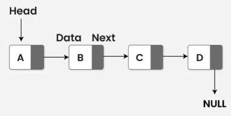

# Linked List

A linked list is a linear data structure where elements are not stored in contiguous memory locations. Instead, each element (node) points to the next element, forming a chain of nodes


## Node Structure

In a singly linked list, each node contains two components: the data and a pointer to the next node.

```c
struct Node {
    int data;
    struct Node* next;
};
```

## Operations

**Traversal**
To traverse a linked list, start from the head node and visit each node by following the next pointers until reaching the end (NULL).

```c
void traverse(struct Node* head) {
    struct Node* current = head;
    while (current != NULL) {
        printf("%d -> ", current->data);
        current = current->next;
    }
    printf("NULL\n");
}
```

**Insertion**

_Insertion at the Beginning_
To insert a new node at the beginning of a linked list, create a new node, set its next pointer to the current head, and update the head to point to the new node.

```c
void insertAtBeginning(struct Node**
headRef, int data) {
    struct Node* newNode = (struct Node*)malloc(sizeof(struct Node));
    newNode->data = data;
    newNode->next = *headRef;
    *headRef = newNode;
}
```

_Insertion at the End_
To insert a new node at the end of a linked list, traverse to the last node, create a new node, and set the next pointer of the last node to the new node.

```c
void insertAtEnd(struct Node** headRef, int data) {
    struct Node* newNode = (struct Node*)malloc(sizeof(struct Node));
    newNode->data = data;
    newNode->next = NULL;

    if (*headRef == NULL) {
        *headRef = newNode;
        return;
    }

    struct Node* last = *headRef;
    while (last->next != NULL) {
        last = last->next;
    }
    last->next = newNode;
}
```

**Deletion**

_Deletion at the Beginning_
To delete the first node of a linked list, update the head to point to the next node and free the memory of the old head.

```c
void deleteAtBeginning(struct Node** headRef) {
    if (*headRef == NULL) {
        return;
    }
    struct Node* temp = *headRef;
    *headRef = (*headRef)->next;
    free(temp);
}
```

_Deletion at the End_
To delete the last node of a linked list, traverse to the second last node, set its next pointer to NULL, and free the memory of the last node.

```c
void deleteAtEnd(struct Node** headRef) {
    if (*headRef == NULL || (*headRef)->next == NULL) {
        deleteAtBeginning(headRef);
        return;
    }
    struct Node* secondLast = *headRef;
    while (secondLast->next->next != NULL) {
        secondLast = secondLast->next;
    }
    free(secondLast->next);
    secondLast->next = NULL;
}
```

**Complete code**

```c
#include <stdio.h>
#include <stdlib.h>

// Node structure
struct Node {
    int data;
    struct Node* next;
};

// Traversal
void traverse(struct Node* head) {
    struct Node* current = head;
    while (current != NULL) {
        printf("%d -> ", current->data);
        current = current->next;
    }
    printf("NULL\n");
}

// Insertion at the Beginning
void insertAtBeginning(struct Node** headRef, int data) {
    struct Node* newNode = (struct Node*)malloc(sizeof(struct Node));
    newNode->data = data;
    newNode->next = *headRef;
    *headRef = newNode;
}

// Insertion at the End
void insertAtEnd(struct Node** headRef, int data) {
    struct Node* newNode = (struct Node*)malloc(sizeof(struct Node));
    newNode->data = data;
    newNode->next = NULL;

    if (*headRef == NULL) {
        *headRef = newNode;
        return;
    }

    struct Node* last = *headRef;
    while (last->next != NULL) {
        last = last->next;
    }
    last->next = newNode;
}

// Deletion at the Beginning
void deleteAtBeginning(struct Node** headRef) {
    if (*headRef == NULL) {
        return;
    }
    struct Node* temp = *headRef;
    *headRef = (*headRef)->next;
    free(temp);
}

// Deletion at the End
void deleteAtEnd(struct Node** headRef) {
    if (*headRef == NULL || (*headRef)->next == NULL) {
        deleteAtBeginning(headRef);
        return;
    }
    struct Node* secondLast = *headRef;
    while (secondLast->next->next != NULL) {
        secondLast = secondLast->next;
    }
    free(secondLast->next);
    secondLast->next = NULL;
}

int main() {
    struct Node* head = NULL;

    // Insertion
    insertAtBeginning(&head, 5);
    insertAtEnd(&head, 10);
    insertAtEnd(&head, 15);

    // Traversal
    printf("Linked List: ");
    traverse(head);

    // Deletion
    deleteAtEnd(&head);
    deleteAtBeginning(&head);

    // Traversal
    printf("Linked List after deletion: ");
    traverse(head);

    return 0;
}

```
